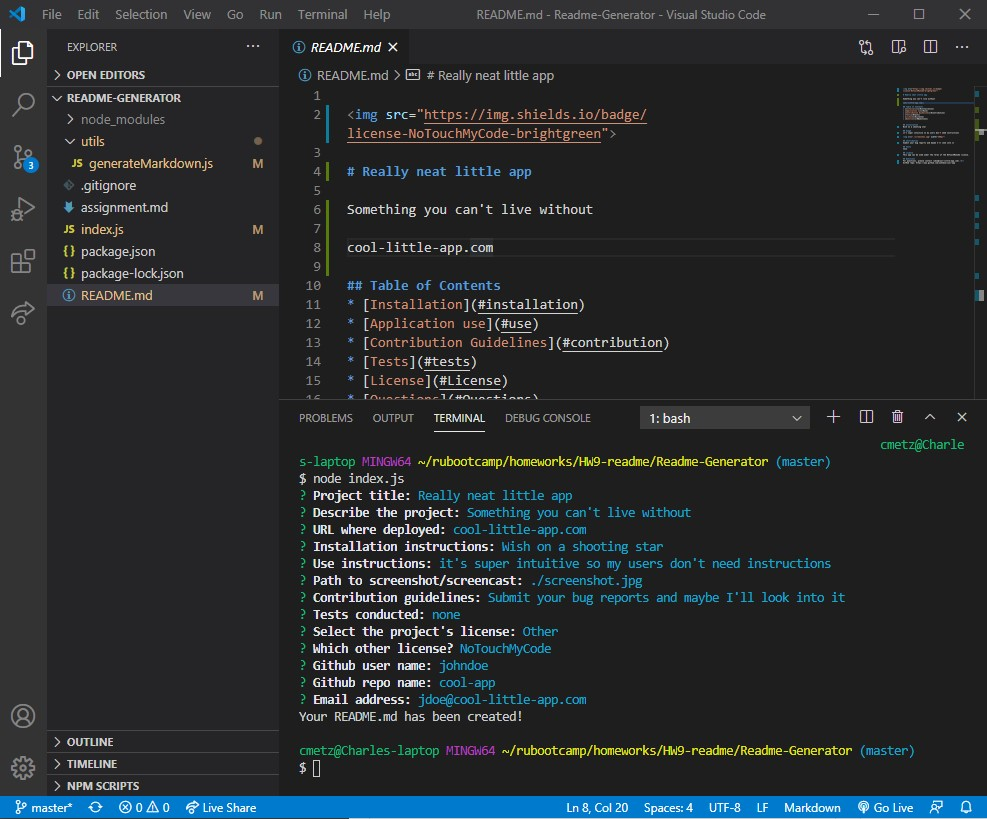
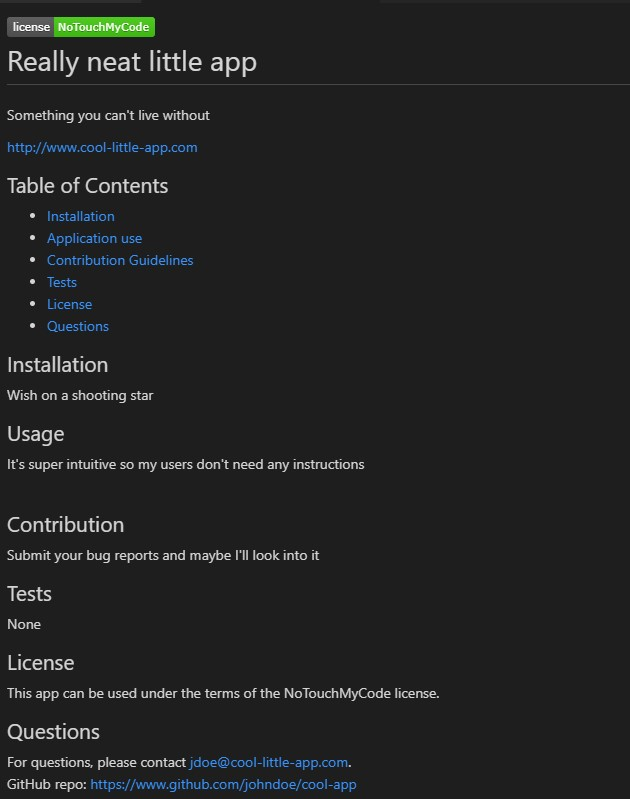

# Quick README Generator
This is a command-line application that generates a README.md file in Markdown syntax. It uses Node's *inquirer module* to prompt the user with a series of questions, requesting information that's commonly included in README files. Once complete, Node's *fs module* will generate the README.md.

## Table of Contents
* [Installation](#installation)
* [Application use](#use)
* [Contribution Guidelines](#contribution)
* [Tests](#tests)
* [License](#License)
* [Questions](#Questions)

## Installation
This is a NodeJS application, so Node must first be installed. Run `npm init` to install the dependencies. In the terminal, type `node index.js` to begin the sequence of prompts.

## Usage
The user will be prompted for the following information:
* Project title
* Description of the project
* URL where it's deployed
* Installation instructions
* Use instructions
* Path to screenshot/screencast (relative or absolute)
* Contribution guidelines
* Tests conducted
* Project license
* GitHub username, repo URL, and owner's email address.  

After all of the prompts are complete, the user will receive a message that the README.md file was created. At this point, it's ready to be uploaded to the GitHub repo.

And remember, it's just a text file written in Markdown, so you can edit it as necessary!

Screenshot of the completed questions: 

Screenshot of the rendered README.md file: 

[Video demonstration (on Google Drive)](https://drive.google.com/file/d/1k-AhMksP9-8xn4z4uZMG7dg3qOwUPeaZ/view):  
https://drive.google.com/file/d/1k-AhMksP9-8xn4z4uZMG7dg3qOwUPeaZ/view

## Contribution
Submit bug and feature requests as issues through the GitHub repo.

## Tests
None

## License
This app can be used under the terms of the MIT license.

## Questions
For questions, please contact <cmetzjr@yahoo.com>. 
GitHub repo: https://www.github.com/cmetzjr/Readme-Generator
